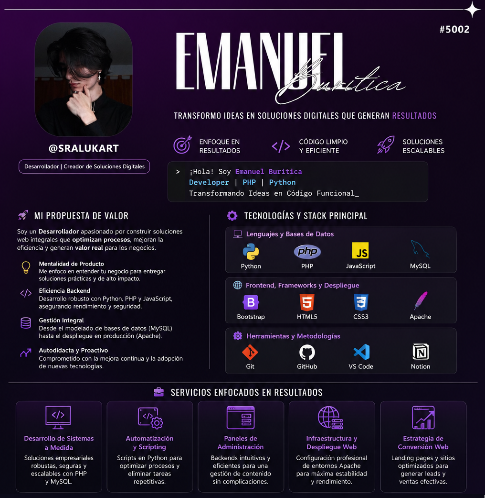

#       Bienvenido o Bienvenida a mi perfil de GitHub

    <h3 style="color:#6a737d;">Desarrollador | Automatización de Procesos | Creador de Soluciones Digitales</h3>
    

---

## 🚀 **Mi Propuesta de Valor**

> Soy un **Desarrollador** impulsado por la pasión de construir soluciones web integrales que no solo funcionan, sino que **optimizan la operación del negocio** y generan valor real. Mi enfoque es transformar requerimientos complejos en **productos digitales eficientes, escalables y fáciles de gestionar**.

**Lo que aporto a un equipo:**

* 💡 **Mentalidad de Producto:** Enfocado en entregar soluciones prácticas y de alto impacto que resuelvan problemas específicos.
* 🔄 **Eficiencia Backend:** Experiencia en desarrollo *core* con **Python, PHP y JavaScript**, asegurando un rendimiento robusto y seguro.
* 📈 **Gestión Integral:** Capacidad para manejar el ciclo de desarrollo completo, desde el modelado de bases de datos (*MySQL*) hasta el despliegue de la aplicación (*Apache*).
* 📚 **Autodidacta y Proactivo:** Compromiso con la integración continua de nuevas tecnologías y mejores prácticas (actualmente explorando **React.js y Laravel**).

---

## 🛠️ Tecnologías y Stack Principal

### 💻 Lenguajes de Programación y Bases de Datos

    <code></code>
    <code></code>
    <code></code>
    <code></code>

### 🌐 Frontend, Frameworks y Despliegue

    <code></code>
    <code></code>
    <code></code>
    <code></code>

### ⚙️ Herramientas y Metodologías

    <code></code>
    <code></code>
    <code></code>
    <code></code>

---

## 💼 Servicios Enfocados en Resultados

* **Desarrollo de Sistemas a Medida (PHP/MySQL):** Creación de soluciones empresariales robustas (CRMs, herramientas internas, etc.) con foco en la **seguridad de los datos** y la **escalabilidad**.
* **Automatización y Scripting (Python):** Desarrollo de scripts y utilidades para **reducir tareas manuales repetitivas**, optimizando el flujo de trabajo y liberando tiempo para actividades de mayor valor.
* **Paneles de Administración Optimizados:** Diseño e implementación de *backends* intuitivos que garantizan una **gestión de contenido eficiente y sin errores** por parte del usuario final.
* **Infraestructura y Despliegue Web:** Configuración profesional de entornos de producción (*Apache*) para asegurar un **despliegue rápido y un alto tiempo de actividad** de la aplicación.
* **Estrategia de Conversión Web:** Construcción de *Landing Pages* y sitios web optimizados no solo estéticamente, sino con una estructura pensada para la **generación efectiva de leads o ventas**.

---

## 🚀 **Proyectos Destacados**

<table>
    <thead>
        <tr style="background-color:#007acc; color:white;">
            <th style="padding:12px; text-align:left;">Proyecto</th>
            <th style="padding:12px; text-align:left;">Funcionalidad Clave y Valor</th>
            <th style="padding:12px; text-align:left;">Stack Principal</th>
        </tr>
    </thead>
    <tbody>
        <tr>
            <td style="padding:12px;">**Sistema CRUD de Clientes**</td>
            <td style="padding:12px;">Gestión integral de datos de clientes, garantizando la **integridad** y la **facilidad** en el mantenimiento de los registros.</td>
            <td style="padding:12px;">PHP, MySQL, Bootstrap</td>
        </tr>
        <tr>
            <td style="padding:12px;">**Gestor de Parqueaderos Inteligente**</td>
            <td style="padding:12px;">Plataforma para el **control automatizado** de espacios, reservas y accesos, maximizando la **eficiencia operativa** del parqueadero.</td>
            <td style="padding:12px;">PHP, MySQL, JavaScript</td>
        </tr>
        <tr>
            <td style="padding:12px;">**Landing Page de Servicios (HTML/CSS)**</td>
            <td style="padding:12px;">Página de alto impacto diseñada para **optimizar la tasa de conversión**, promocionando servicios profesionales de forma clara y persuasiva.</td>
            <td style="padding:12px;">HTML, CSS, JavaScript</td>
        </tr>
    </tbody>
</table>

---

## 📈 Crecimiento y Habilidades Futuras

Actualmente estoy enfocado en la adopción de frameworks que permitan construir aplicaciones de próxima generación, robustas y modernas:

* ⚛️ **React.js:** Para el desarrollo de Single Page Applications (SPA) y UI/UX de alto rendimiento.
* ⚙️ **Laravel (PHP):** Para la creación de aplicaciones back-end con arquitectura limpia y escalabilidad empresarial.
* 🔗 **Diseño de APIs RESTful:** Para garantizar una comunicación eficiente y estandarizada entre servicios y sistemas.
* ✅ **Metodologías Ágiles (Scrum):** Adoptando las mejores prácticas para la gestión eficiente y colaborativa de proyectos de software.

---

### 📊 GitHub Stats (Tu Actividad Dice Mucho)

    
    

---

## 📬 Conversemos

Si necesita un desarrollador con enfoque en la eficiencia y la entrega de valor, no dude en contactarme.

    
    

    

